# Spring Cloud Bus 家族体系介绍

中文参考资料  
https://xy2401.com/local-docs/spring1.zh/Greenwich.SR4/single/spring-cloud.html

https://docs.gitcode.net/spring/guide/spring-integration/message-transformation.html#%E8%BD%AC%E6%8D%A2%E5%99%A8

## 背景

由于公司需要使用到SpringCloudStream，且使用最新的SpringCloud体系，所以需要重新整理相关的技术文档，并在项目中应用。SpringCloudStream在3.0的新版中，引入了新的特性，使得使用办法更加简单，同时也和其他几个组件配合度更高。比如SpringCloudFunction。

以前的项目中使用的是SpringCloudStream2.0版本，在项目中，我们在微服务的服务端，通过`SpringIntegration`提供的`@MessagingGateway`
注解，通过interface的Api来发起异步调用。在业务代码的架构设计中，我们将所有的`@Output`相关的配置，全部放到了业务模块的兄弟模块stream模块中。业务架构如图所示

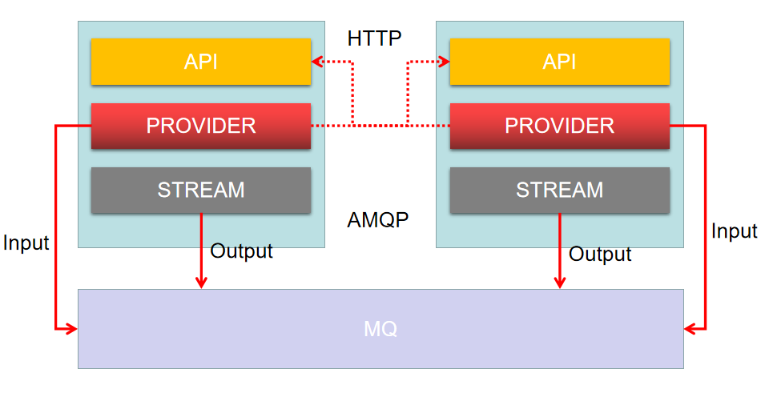

Api模块主要提供常量、POJO和OpenFeign的调用接口，可以说在微服务体系中作为客户端，向指定微服务发起调用。而Stream模块，主要是在其中声明和注册SpringCloud中的Output通道。而服务端核心，Provider则扮演启动起来的微服务服务端角色。在工程项目中，Api和Stream会提供出去，作为其他的provider的依赖模块，扮演者客户端的身份，发起调用。具体地说，和OpenFeign相同的，我们定义Gateway相关的接口，放到Stream模块，发起调用时，引入对应服务的stream模块，调用对应的gateway接口，来使用springcloudstream体系。

也就是说，我们深入的使用了`Spring Integration`，加入新版本的CloudStream引入了`SpringCloudFunction`
，加上技术经理让一步到位的引入`SpringCloudBus`，所以涉及到内容比较多，写一篇手册来整合这些内容是比较有必要的。毕竟他们的相关内容是散落在各个模块手册中的。

## SpringCloudStream

（当前版本3.2.1）

围绕SpringCloudStream的概念有：

* **Destination Binders**：与外部消息系统进行集成
* **Destination Bindings**：终端用户提供的应用代码（生产者/消费者）和外部消息系统之间的桥梁
* **Message**：经典的用于生产者和消费者与外部消息系统进行交流通行的数据结构

实现的binder有：

* [RabbitMQ](https://github.com/spring-cloud/spring-cloud-stream-binder-rabbit)
* [Apache Kafka](https://github.com/spring-cloud/spring-cloud-stream-binder-kafka)
* [Kafka Streams](https://github.com/spring-cloud/spring-cloud-stream-binder-kafka/tree/master/spring-cloud-stream-binder-kafka-streams)
* [Amazon Kinesis](https://github.com/spring-cloud/spring-cloud-stream-binder-aws-kinesis)
* [Google PubSub *(partner
  maintained)*](https://github.com/spring-cloud/spring-cloud-gcp/tree/master/spring-cloud-gcp-pubsub-stream-binder)
* [Solace PubSub+ *(partner
  maintained)*](https://github.com/SolaceProducts/spring-cloud-stream-binder-solace)
* [Azure Event Hubs *(partner
  maintained)*](https://github.com/microsoft/spring-cloud-azure/tree/master/spring-cloud-azure-stream-binder/spring-cloud-azure-eventhubs-stream-binder)
* [AWS SQS *(partner maintained)*](https://github.com/idealo/spring-cloud-stream-binder-sqs)
* [AWS SNS *(partner maintained)*](https://github.com/idealo/spring-cloud-stream-binder-sns)
* [Apache RocketMQ *(partner
  maintained)*](https://github.com/alibaba/spring-cloud-alibaba/wiki/RocketMQ-en)

### EIP

SpringCloudStream起始于EIP（ [Enterprise Integration Patterns](http://www.enterpriseintegrationpatterns.com/)
），即企业集成模式。EIP和ESB有很多相似之处，都是期望通过消息将各个子系统解耦。而EIP最核心的就是基于消息集成。在这种情况下，各个组件之间不再通过远程调用等同步的方式，而是通过向目标系统发送一个消息来执行某个功能，而消息发送成功之后，调用方就可以处理其他的人，不再同步等待。这种方式，显而易见的，增大的系统的吞吐量。

基于消息，可以使得整个系统异构，各个组件之间不需要关心其他组件的开发语言，开发框架。开发人员可以根据需求选择合适的开发技术，进而降低开发成本，提高代码质量。这种隔离还可以让各个组件之间独立的进行测试和升级，如果一个组件发生了问题，并不会将影响扩散到其他组件。而且消息的发送方，还可以将消息缓存在本地，等到接收方恢复正常后，再次发送。

在系统中，使用消息，并不是一对一传递这么简单，往往需要对消息进行拆分，比如把一个消息拆成十份，以便于多个消息接收方并行的处理。或者将一个消息广播给所有其他实例。

好在这些不需要我们自己写代码来完成，很多消息系统都提供这样的能力，我们只需要进行一系列的配置来控制消息系统的运行方式即可。在使用EIP的时候，我们就需要理清楚消息系统和业务逻辑的边界：**
在消息处理的整个过程中，任何与消息分发传递相关的工作都应该有消息系统完成，而对消息所包含的信息处理则是连接到消息系统的上的各个子服务的责任。**

也正是因为如此，消息常常分为两个部分，消息头和负载。消息头用来记录消息的元数据，以用来控制消息如何被处理，是需要由消息系统来使用的数据，与参与集成的各个子服务无关，而负载用来记录消息的实际内容，是由参与集成的各个子服务所需要处理的数据，而与消息系统无关。

在一个子系统希望与其他子服务进行沟通时，常常只需要关心发送出去的消息内容，而不需要关系如何生成这些消息的元数据。

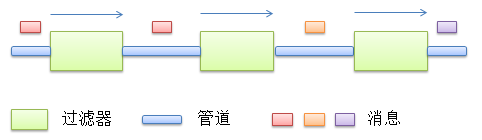
上图展示了消息系统的Pipes and
Filters模型。传递消息的Pipe通道，对消息进行处理的过滤器Filter。这些通道将过滤器串联起来。而消息则会沿着通道流动。在EIP，将模型更近了一步，一个过滤器不仅仅是一个输入一个输出，而是多个输入，多个输出，如下图:

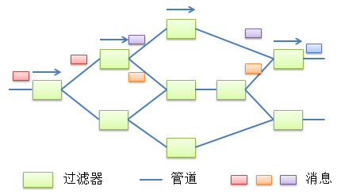

这样的是可以将分割出的步骤给多个业务系统重用，进而组成一种比较复杂的拓扑结构。

从多个输出管道中选择消息的派发目标通常是由路由器来完成的，一个路由器可以链接多个输出通道，并根据消息内容来判断所需派发的管道。

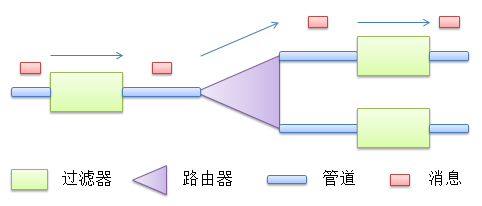

输出和输出消息不同，如果是业务逻辑处理后的输出，其不同很容易理解，而另一种不同，更像是适配器，将消息A转为消息B以便于另一个管道能够能够消费消息。在多个系统中，对于同一个模型往往有多种数据模型，过滤器的这个功能十分重要，是的不同的数据模型，可以相互转化。

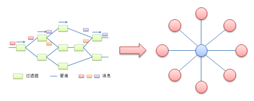

最后，通过消息系统提供的客户端，我们就可以向管道中插入消息或者取出消息。

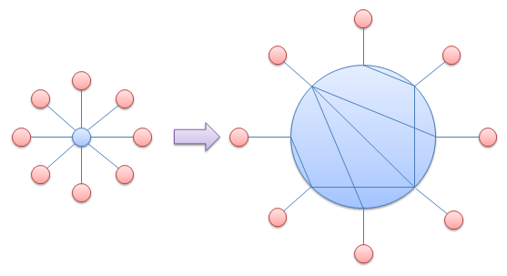

管道是有向的。从一个方向到另一个方向。实际上每个管道都可以看做是一个消息池，而管道的使用就有了消费者和生产者之分。对于一个管道而言，如果链接的过滤器是生产者，那么它只能往管道中放入消息，而不能取消息，否则自己放的消息就会被自己接受。消费者类似。

一个管道可以拥有一个或者多个生产者或者消费者，这是往往是不受限制的。

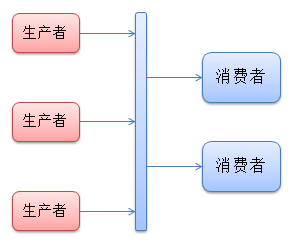

而且，同一个管道的消费也都是等效，如果消费者A可以接受到某个消息，那么消费者B也应该可以接收到这个消息。

管道有两种不同的消息分发方式。Point-to-Point以及Publish-Subscribe。

点对点式，只有一个消费者能够接收到消息，而订阅发布模式中，所有的消费者都会收到该消息

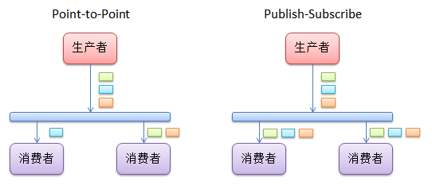

一个消息被放置于管道时，消息系统会根据消息的元数据，来对信息进行处理。而过滤器接收到消息时，其需要知道消息负载所具有的格式，以及如何对负载进行解析。所有EIP提供了Datatype
Channel，以便于用户显示的标明在该管道中所传输的数据类型。

对于异常EIP提供了Dead Letter Channel和Invalid Message
Channel,来应对异常情况。当消息无法发动到过滤器时，将消息放到DLC中，如果过滤器正常接收到了消息却无法处理，将消息放到Invalid Message中。

通常情况下，消息系统会为管道预设一个DLC和IMC。

还有消息的路由器，基于内容的路由器 Content-Base Router 一个输入多个输出

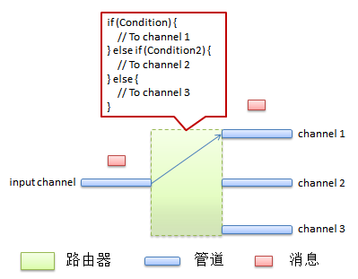

Message Filter的过滤器，当输入管道传过来的消息不满足Message Filter的条件时，丢弃该消息。

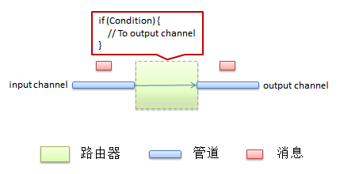

将消息过滤器和发布订阅模式结合：

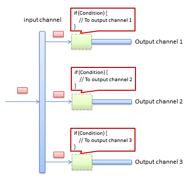

这样的问题是，有的消息可能没有到达合适的地方就被丢弃，或者有的管道有太多的过滤器。一个解决办法是，管道接收端将自身的处理能力通过ControlChannel注册到一个路由器中，这样路由器可以根据自身所记录的处理能力来自动派发。

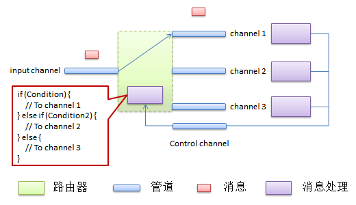

更进一步的，我们有的Dynamic
Router。动态路由，接收端可以通过channel在运行加入自身。但是这就失去了前面提到的MessageFilter的将消息发送给多个接收端端的好处，想要这么做，我们需要
RecipientList。可以将符合条件的消息放到多个管道中。


和Contend-Based Router需要考虑接收端的添加和删除一样，我们也需要考虑
RecipientList中接收端的添加和删除，解决方案和DynamicRouter一样，就是通过一个ControlChannel来允许接收端的加入、离开和监听条件的修改。

还有对消息进行拆分的Splitter

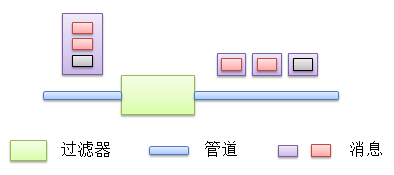

Composed Message
Processor包含一个输入管道和一个输出管道。在一个复杂的消息到达输入管道后，其内部所包含的Splitter将会把该复杂消息切分为一系列粒度较小的子消息，并通过一个Router（Content-Based
Router，Dynamic Router，Message Filter等）将消息分发到不同的子系统中。而在所有的子系统将这些子消息处理完毕以后，Composed Message
Processor将通过Aggregator再将这些响应组织在一起：

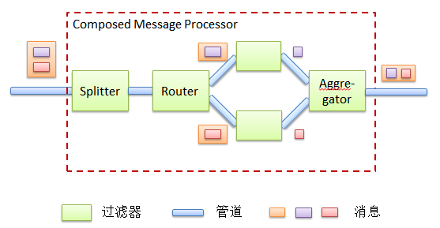

一个与Composed Message
Processor模式类似的模式则是Scatter-Gather模式。它们两者之间最主要的不同就是Scatter-Gather模式是将消息广播到一系列接受方，然后再由Aggregator进行汇总。也就是说，其同样只有一个输入管道和一个输出管道。当一个消息通过输入管道传递到Scatter-Gather管道之后，其内部将会把该消息分发到多个接受方。而后其会使用Aggregator将众多消息处理结果归结在一起：

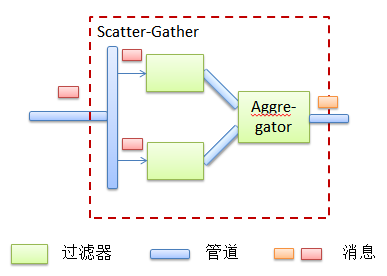

上图中所列出的一个Scatter-Gather的实现就是通过一个Publish-Subscribe管道来完成的。在这种情况下，所有连接在该管道上的各个过滤器都将会接收到该消息。如果需要控制哪些过滤器会接收到该消息，那么我们就需要使用Recipient
List来对消息进行分发：

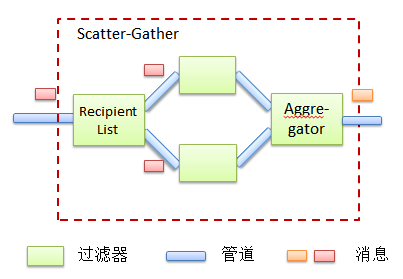

另一种组合模式就是Routing
Slip。当一个消息到达该模式实现时，其将首先决定该消息应该如何在各个过滤器之间路由，并将各路由路径附加到该消息上。接下来，该消息就会依次通过该路由信息所记录的各个过滤器：

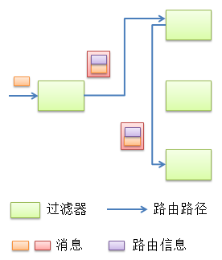

更多细节查看[Enterprise Integration Pattern - 组成简介](https://www.cnblogs.com/loveis715/p/5185332.html)和[Enterprise
Integration
Pattern](http://www.amazon.com/Enterprise-Integration-Patterns-Designing-Deploying/dp/0321200683)

### 基于数据集成，结合SpringIntegration和SpringBoot

所以SpringCloudStream产生了，他的好处有：

* 独立的构建、测试、部署以数据为中心的应用程序
* 用现代的微服务架构，包括通过消息进行组合
* 以事件为中心的思想来分离程序指责。下游程序不必关心事件的起源或者生产者的身份
* 将业务逻辑移植到消息代理上
* ...

> springcloudstream推荐使用头部信息来运用路由器，而不是消息负载。就像发邮件一样，你不会希望快递员查看邮件内容才能决定如何派发数据。如果说路由一定要基于消息载荷的格式，那么可以考虑将其标注到头部，比如`application/json;type=foo.bar.Baz`这样springEL表达式就可以在此基础上进行操作和路由。

### SpringCloudStream核心概念

* SpringCloudStream的应用模型
* Binder抽象
* 持久化的publish-subscribe支持
* 消费者分组支持
* 分区支持
* 可插板的BinderSPI

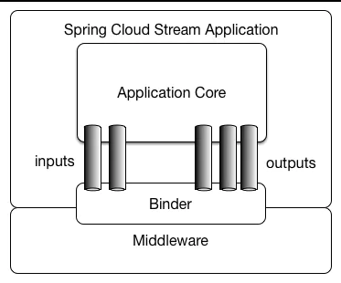

> 这里我们不会对Binder抽象和BinderSPI过多讨论。可以理解Binder就是各个消息系统对接SpringCloudStream体系的巨大的适配器，通过SPI机制融入到stream体系中。

#### inputs和outputs

结合上面EIP所述，可以知道Inputs和outputs就是管道，而且是指明了方向的管道。outputs是应用通过Binder消息系统r向发送消息。而inputs则是应用通过binder从消息系统中获取消息。

#### 消费者分组

消费者分组。从EIP介绍可以知道，发布订阅模型中，对于生产者生产的消息A，如果有十个消费者，那么这十个消费者是都能接收到的。那么引入分组后，我们就可以以组为单位消费，如果消费者A组，任意一个消费者消费到了数据，那么就认为这个消费组消费了。这样可以避免重复消费的问题。

消息组的订阅是Durability，持久的。

#### 分区

有的消息系统不支持自然分区（kafka），但是没关系，无论代理本身是否自然分区，都可以使用分区。

分区是状态处理的关键概念，可以确保相关数据一起处理。比如，按照时间段，接受给定的传感器数据，最后输出平均值。确保时间窗口内，给定的数据都由同一个应用程序处理是很重要的。

#### Destination Binders

目标绑定器，是SPringCloudStream的拓展组件，负责与生产者和消费者之间的连接、委托和消息路由、数据类型转换、用户代码调用等。

#### Bindings

绑定提供了与外部消息系统（队列，主题等）沟通的桥梁

##### Binding和Binding names

基于函数的绑定，Function既有in又有out，Consumer只有in代表消费者，Supplier只有out代表生产者。

```java

@SpringBootApplication
public class SampleApplication {

  @Bean
  public Function<String, String> uppercase() {
    return value -> value.toUpperCase();
  }
}
```

比如上面的那个bean，就会有两个bindings，uppercase-in-0和uppercase-out-o

bindings的命名规则如下：

* input: `<functionName>-in-<index>`
* output: `<functionName>-out-<indhex>`

如果你想吧函数的输入映射到消息系统的比如Topic或者queue中，那么可以使用属性destination：

`--spring.cloud.stream.bindings.uppercase-in-0.destination=my-topic`

##### bindings 别名

比如把uppercase-in-0改名为input，可以这样配置`--spring.cloud.stream.function.bindings.uppercase-in-0=input`

但是springcloudstream并不推荐你这么做

#### 生产和消费数据

这里新版本用就是SpringCloudFunction了。只要定义`java.util.function.[Supplier/Function/Consumer]`类型给的bean即可。

同时，配置上，需要使用` spring.cloud.function.definition`来具体的指明某个bean来绑定到bindings上（也就是有in和out的bindings）

> 如果你只有单个的类型为`java.util.function.[Supplier/Function/Consumer]`的bean，那么他会被自动发现和自动绑定的。但是如果这个单一的bean并不是你想用来作为output和input的bindings，那么你可以设置`spring.cloud.stream.function.autodetect=false`来取消自动发现和自动绑定。

##### 生产数据

```java

@SpringBootApplication
public static class SourceFromSupplier {

  @Bean
  public Supplier<Date> date() {
    return () -> new Date(12345L);
  }
}
```

由于其实生产者，所以并不像Function和Consumer一样有触发机制，所以他需要不同的机制poller。spring提供一种轮询机制来确定其多久调用一次。参考**[轮询配置](#轮询配置)**

##### 消费数据

基于反应式的消费者

```java
public Function<Flux<?>,Mono<Void>>consumer(){
    return flux->flux.map(..).filter(..).then();
    }
```

##### 轮询配置

前缀为`spring.cloud.stream.poller`，但是从stream3.2以后就不推荐了

###### fixedDelay

###### maxMessagesPerPoll

###### **cron**

###### **initialDelay**

###### timeUnit

##### 向外部系统发送数据

上面提到Supplier通过轮询机制来触发。那么Consumer的input从哪里获取到数据呢？当然是destination。那么如果我想通过output通道来产生数据怎么做？注册一个不会实际使用的Function的bean，借用他的output通道来传递消息吗？

不需要，就像3.1之前的@Output注解定义一个字符串为output的bean一样，我们用`--spring.cloud.stream.output-bindings=toStream`
的方式来声明这个output

```java

@SpringBootApplication
@Controller
public class WebSourceApplication {

  public static void main(String[] args) {
    SpringApplication.run(WebSourceApplication.class,
        "--spring.cloud.stream.output-bindings=toStream");
  }

  @Autowired
  private StreamBridge streamBridge;

  @RequestMapping
  @ResponseStatus(HttpStatus.ACCEPTED)
  public void delegateToSupplier(@RequestBody String body) {
    System.out.println("Sending " + body);
    streamBridge.send("toStream-out-0", body);
  }
}
```

如上所示，我们就有了一个toStream-out-0的bean。

###### 动态绑定

上面说的配置的方式，是静态绑定，实际上我们可以使用动态绑定的功能。

```java

@SpringBootApplication
@Controller
public class WebSourceApplication {

  public static void main(String[] args) {
    SpringApplication.run(WebSourceApplication.class);
  }

  @Autowired
  private StreamBridge streamBridge;

  @RequestMapping
  @ResponseStatus(HttpStatus.ACCEPTED)
  public void delegateToSupplier(@RequestBody String body) {
    streamBridge.send("myBinidng", body);
  }
}
```

其中myBiniding是可以动态传入的。如果没有myBiniding，那么会创建并缓存一个myBiniding，如果有的话，会自动使用已有的。（值得注意的是，由于动态绑定可能导致内存泄露，所以默认只会缓存十个，如果超过这个大小，现有的绑定可能被放弃。可以通过`spring.cloud.stream.dynamic-destination-cache-siz`
来改成合适的值）

## SpringCloudStreamRabbitBinder

我们需要先选一个MQ作为SpringCloudStream实现的载体，RabbitMq和Kafka都是官方提供的binder实现，当然rocket的binder也是有的，鉴于公司用的`rabbit mq`
我们就从`Spring Cloud Stream Rabbit Binder`开始讲


上面的简图，简要的介绍了rabbitmq一些操作。围绕上面的图，我们展开来讲。默认情况下，RabbitMQ会为每个destination映射一个TopicExchange。每一个消费者的group则对应的是queue，这个Queue会绑定到对应的TopicExchange上。每一个消费者实例的group都会有对应的RabbitMQ实例与之对应。对于采用了分区的消费者和生产者，他们的队列则会对应的加上分区的前缀，并且用分区索引作为路由的key。对于匿名的消费者（就是没有配置group的属性的消费者）会用一个自动删除队列且用随机唯一的名字。

如果使用了`autoBindDlq`，即自动绑定死信队列，你可以配置一个死信队列（DLQ）和`DLX`
，也就是对应对的死信交换器，这样他们就可以使用底层的路由机制。默认情况下，死信队列会使用destination的名字加上`.dlq`
的后缀。如果重试机制的最大重试次数大于1（默认是3），那么会在三次失败之后，才会把消息发送到对应的死信队列。如果重试被关闭了，比如设置`maxAttempts=1`
，那么失败的消息就会立即发送到死信队列，此时，你应该设置`requeueRejected`
为false，即关闭拒绝重新投递服务，这样失败的消息就会被路由到死信队列，而不是重新投递（re-queue）。`republishToDlq`
配置会让binder发布失败的消息到DLQ中，而不是直接拒绝他。这个功能允许提供更多的消息，比如栈跟踪，通过`x-exception-stacktrace`
消息头，参考`frameMaxHeadroom`属性。这个功能不需要开启重试功能。你可以在一次重试后就重新发布消息。你也可以对重新发布的消息设置交付方式（`delivery mode`
）,参考`republishDeliveryMode`属性。

如果stream listener抛出了`ImmediateAcknowledgeAmqpException`异常，那么`DLQ`
就会被绕过，消息就会被丢弃，这是从2.1版本开始的，而不管你有没有设置`republishToDlq`。之前的版本中，他只会发生在你设置`republishToDlq`为false的情景下。

> 重点：设置`requeueRejected`为true同时搭配`republishToDlq=false`，会让消息重新投放到队列并不断地重新交付，即拒绝重新排队，同时也不投递到死信队列。如果失败是因为网络等短暂的原因，那么是可被允许的。若是其他情况下的异常，你可能不想要他一直被投递。一般来说，设置最大重试次数`maxAttempts`大于一会或者设置`republishToDlq`为true是很好的选择。

从3.1.2版本开始，如果消费者被标记为`transacted`
即开启了事务，那么发布到死信队列的行为会被加入到事务中。这样就允许为失败的发布进行回滚。如果连接工厂，设置了发布者确认机制或者返回机制，那么发布到死信队列的行为则会等待确认信息，或者返回信息。如果返回的缺失是`negative ack`
或者接收到了失败类型的消息，那么binder会抛出`AmqpRejectAndDontRequeueException`
异常。允许broker重新考虑发布消息到DLQ，就像`republishToDlq`属性是false一样。

本框架并不提供单独的消费死信队列或者重新路由的机制，更多描述参考`rabbit-dlq-processing`

> 注意： 如果你用了多个rabbitmq的binder，请把RabbitAutoConfiguration类在@SpringbootApplication注解中标注为去除，避免多个binder使用同样的配置

从2.0版本开始，`RabbitMessageChannelBinder`设置`RabbitTemplate.userPublisherConnection`
为true。这样没有事务的生产者就可以避免在消费者上产生死锁（deadlocks）。这种情况会发生在缓存起来的链接被阻塞住了，这是因为 [memory alarm](https://www.rabbitmq.com/memory.html)。

> 注意：当前情况下，多路复用的消费者，（一个消费者监听多个生产者）仅支持基于消息驱动的消费者；polled的也就是轮询的消费者只能从单一队列中接受消息。

### 配置选项

这里只介绍rabbit相关的特殊配置，更多的公共的配置直接看SpringCloudStream的介绍。

#### binder相关配置

##### *spring.cloud.stream.rabbit.binder.adminAddresses*

用逗号分隔的RabbitMQ management plugin URLs。当且仅当`nodes`
包含超过一个键值对。而且每个键值对都必须要有对应的`spring.rabbitmq.addresses`
。只有在你使用rabbitmq集群而且希望从某个节点消费数据的时候需要配置。参考[队列选择](https://docs.spring.io/spring-amqp/reference/html/#queue-affinity)。这个功能实际上是management
plugin提供的，他会提供一个REST的API，来返回队列所在的物理节点。

默认 `empty`

##### *spring.cloud.stream.rabbit.binder.nodes*

用逗号分隔的RabbitMQ node names；当超过一个键值对的时候使用。用它来确定对应队列的服务端地址。同样的每个键值对都必须要有对应的`spring.rabbitmq.addresses`
。和上面的配置相同，参考[队列选择](https://docs.spring.io/spring-amqp/reference/html/#queue-affinity)。

默认 `empty`

##### *spring.cloud.stream.rabbit.binder.compressionLevel*

压缩bindings的压缩等级，参考`java.util.zip.Deflater`。

默认 `1` （BEST_LEVEL）

##### *spring.cloud.stream.binder.connection-name-prefix*

链接名称前缀，

默认 `none`

#### RabbitMQ Consumer Properties 消费者配置

一下配置只对rabbitmq的消费者生效，且必须遵从格式为`spring.cloud.stream.rabbit.bindings.<channelName>.consumer.`

如果要为所有的rabbitmq的消费进行某个属性的统一设置，可以使用这个格式``spring.cloud.stream.rabbit.default.<property>=<value>`

注意，特别的单独配置，会盖住默认的配置。

##### *acknowledgeMode*

*acknowledgeMode*类型

默认为 `AUTO`

##### *anonymousGroupPrefix*

匿名组前缀。（当消费者没有配置group属性的时候，默认采用` anonymous.<base64 representation of a UUID>`的命名方式）

默认 `anonymous.`

##### *autoBindDlq*

自动绑定死信队列，也会绑定对应的DLX

默认 false

##### *bindingRoutingKey*

路由的key，决定绑定queue到某个exchange，（如果bindQueue设置为true的话）。可以设置多个key通过`bindingRoutingKeyDelimiter`
如果destination被分区了的话，那么`-<instanceIndex>`会被拼接到每个key后面。

默认： `#`

##### *bindingRoutingKeyDelimiter*

routingkey的界定符。一般是comma，也就是逗号

默认 `null`

##### *bindQueue*

绑定队列。是否声明队列并绑定到对应的destination exchange。如果你已经预先创建好了自己的基础架构并绑定好了队列，可以设置为false

默认 `true`

##### *consumerTagPrefix*

消费者标签前缀会被添加到`#n`后面，`n`
是会自增的。比如`${spring.application.name}-${spring.cloud.stream.bindings.input.group}-${spring.cloud.stream.instance-index}`

默认 `none` broker会自动生成随机的消费者标签

##### *containerType*

选择监听者的容器类型，参考Spring AMQP
中的[Choosing a Container](https://docs.spring.io/spring-amqp/reference/html/_reference.html#choose-container)

默认`simple`

##### *deadLetterQueueName*

死信队列名称

默认 `prefix+destination.dlq`

##### *deadLetterExchange*

死信交换机，必须要`autoBindDlq`为true

默认 `prefix+DLX`

##### *deadLetterExchangeType*

死信交换机类型。对应rabbitmq的交换机类型，必须要`autoBindDlq`为true

默认 `direct`

##### *deadLetterRoutingKey*

死信路由键。必须要`autoBindDlq`为true

默认 `destination`

##### *declareDlx*

是否为destination声明一个死信交换机。必须要`autoBindDlq`为true。如果提前设置了DLX，可以关闭掉。

默认 `true`

##### *declareExchange*

是否为destination声明一个交换机。

默认 `true`

##### *delayedExchange*

是否声明交换机为延迟交换机，即`Delayed Message Exchange`。需要broker上有对应的`delayed message exchange plugin`
延迟消息交换机插件。会设置为exchange设置`x-delayed-type`参数。

默认： `false`。

##### *dlqBindingArguments*

在死信的binding上添加参数。通过`headers deadLetterExchangeType`的设置方式，比如`...dlqBindingArguments.x-match=any`
，`…dlqBindingArguments.someHeader=someValue`

默认：`empty`

##### *dlqDeadLetterExchange*

如果DLQ被声明了，那么DLX也会被关联到对应的队列

默认：`none`

##### *dlqDeadLetterRoutingKey*

如果DLQ被声明了，那么死信路由key也会被关联到对应的队列

默认：`none`

##### *dlqExpires*

死信队列失效时间

默认：`no expiration`

##### *dlqLazy*

使用`x-queue-mode=lazy`
属性声明死信队列。参考 [“Lazy Queues”](https://www.rabbitmq.com/lazy-queues.html)。建议用策略`policy`来代替这个设置，因为使用`policy`策略就可以修改设置，而不用删除队列。

默认： `false`。

##### *dlqMaxLength*

死信队列最大数量

默认：`no limit`

##### *dlqMaxLengthBytes*

死信队列最大字节长度。所有消息加起来

默认：`no limit`

##### *dlqMaxPriority*

死信队列优先级，0-255

默认：`none`

##### *dlqOverflowBehavior*

当`dlqMaxLength`或者`dlqMaxLengthBytes`条件被触发时，即溢出时。当前有`drop-head`和`reject-publish`
两个方案，具体的要看rabbitmq的官方文档。

默认：`none`

##### *dlqQuorum.enabled*

被设置为true时，创建一个`quorum dead letter queue`队列，而不是传统的队列

默认： `false`。

##### *dlqQuorum.deliveryLimit*

当`quorum.enabled=true`被设置时，对于消息删除和发生死信设置一个交付限制。

默认：`none`，broker会有默认设置

##### *dlqQuorum.initialQuorumSize*

当`quorum.enabled=true`被设置时，设置一个quorum的初始化容量

默认：`none`，broker会有默认设置

##### *dlqSingleActiveConsumer*

被设置为true时，设置`x-single-active-consumer`队列属性为true

默认： `false`。

##### *dlqTtl*

死信队列存活时长

默认：`no limit`

##### *durableSubscription*

订阅持久化。只有在`group`也被设置的时候才会有效。

默认 `true`

##### *exchangeAutoDelete*

如果`declareExchange`是true，声明的exchange是否应该自动删除。（会在最后一个队列被删除后才删除）

默认 `true`

##### *exchangeDurable*

交换机持久化。也就是说是否在broker重启后还存在

默认 `true`

##### *exchangeType*

交换机类型，对应rabbitmq的交换机类型。比如可以为不分区的destinations声明`direct`，`fanout`，`headers`，或者`topic`
类型，为分区的destinations声明`direct`，`headers`或者`topic`

默认：`topic`

##### *exclusive*

是否设置一个专属的。当这个被设置为true的时候，并发数量应该也被设置为1。通常用在严格按照顺序消费的场景下，同时允许热部署，来接管失败的场景。参见`recoveryInterval`
。推荐使用`singleActiveConsumer`来代替这个属性，当你的RabbitMQ版本高于3.8。

默认： `false`。

##### *expires*

一个队列多久不用，会被删除。单位毫秒

默认： `no expiration`

##### *failedDeclarationRetryInterval*

重新消费间隔

默认：`5000`

##### *frameMaxHeadroom*

当添加栈跟踪信息时，预定的框架最大头部空间。所有的header的空间都必须小于`frame_max`，这被设置在broker上。栈跟踪信息可以更大些。如果这个空间大于`frame_max`
，那么`stack trace`会被删除。同时输出一个警告日志。这个时候就要考虑增大`frame_max`。或者减少`stack trace`的体积（通过捕获异常，来输出更加简短的异常跟踪信息）

默认：`20000`

##### *headerPatterns*

入栈的标准头部映射

默认：`['*']`（所有头部）

##### *lazy*

声明队列时，使用` x-queue-mode=laz`
属性，参考 [“Lazy Queues”](https://www.rabbitmq.com/lazy-queues.html)。建议用策略`policy`来代替这个设置，因为使用`policy`策略就可以修改设置，而不用删除队列。

Default: `false`.

##### *maxConcurrency*

最大并发数量。当`containerType`类型为`direct`时，该设置不被支持。

Default: `1`.

##### *maxLength*

队列中最大消息数量

Default: `no limit`

##### *maxLengthBytes*

队列中最大字节长度

Default: `no limit`

##### *maxPriority*

最大优先级 0-255

Default: `none`

##### *missingQueuesFatal*

当找不到对应的队列时，将其视为致命错误，停止监听的容器。

Default: `false`

##### *overflowBehavior*

超过最大限制，产生溢出时的行为。`maxLength`或者`maxLengthBytes`被触发。当前有`drop-head`和`reject-publish`
两个方案，具体的要看rabbitmq的官方文档。

##### *prefetch*

预取数量

Default: `1`.

##### *prefix*

destination和queues的前缀

Default: "".

##### *queueBindingArguments*

绑定队列到exchange时应用的参数，通过`headers deadLetterExchangeType`的设置方式，比如`...dlqBindingArguments.x-match=any`
，`…dlqBindingArguments.someHeader=someValue`

Default: empty

##### *queueDeclarationRetries*

声明队列失败后的重试次数。只有`missingQueuesFatal`属性被设置为true时才会生效，否则会无限重试。当`containerType`类型为`direct`时，该设置不被支持。

##### *queueNameGroupOnly*

被设置为true时，队列的消费者会和group同一个名字。其他情况下，队列的名字会是`destination.group`
。这很有用，特别是使用springcloudstream来消费一个已经存在的rabbitmq 队列时。

Default: false.

##### *quorum.enabled*

为true时，创建一个`quorum queue`队列，而不是传统的队列。

Default: false

##### *quorum.deliveryLimit*

当`quorum.enabled=true`被设置时，对于消息删除和发生死信设置一个交付限制。

默认：`none`，broker会有默认设置

##### *quorum.initialQuorumSize*

`quorum queue`队列初始化的quorum容量

默认：`none`，broker会有默认设置

##### *recoveryInterval*

连接回复重试时间间隔，单位毫秒

Default: `5000`.

##### *requeueRejected*

当重试被禁用或者`republishToDlq`为false后，是否在交付失败时，重新投递到队列中

Default: `false`.

##### *republishToDlq*

重新发布到死信队列中。（在重试失败后）

Default: `true`

##### *republishDeliveryMode*

当`republishToDlq`为`true`时设置重新发布的交付模式。

Default: `DeliveryMode.PERSISTENT`

##### *transacted*

是否使用事务通道

Default: `false`.

##### *ttl*

声明队列后，队列的存活时间，单位毫秒。

Default: `no limit`

##### *txSize*

在acks之间限制交付的数量。当`containerType`类型为`direct`时，该设置不被支持。

#### Advanced Listener Container Configuration监听容器高级设置

设置监听容器属性配置（不是通过binder或者bindings的配置）。添加一个单独的bean，类型为`ListenerContainerCustomizer`
，并注册到容器中。这样binder和bindins的配置会被设置，同时定制化的内容也会被调用。

定制化的`configure()`方法提供队列名字和消费组。

##### Advanced Queue/Exchange/Binding Configuration 队列 交换机 绑定器的高级设置

rabbitmq团队会不时的更新新的功能特性，而对应的通过properties来绑定的方式，并不是实时跟进的，可能得等到下一个版本。从3.0.1版本开始，我们通过`DeclarableCustomizer`
beans，来提供给容器修改某个声明的queue，exchange，或者binding。这样在他们真正被使用前，某些属性就被修改，同时高级的特性能被应用。

###### Receiving Batched Messages 接受批量消息

通过rabbitmq binder 有两个批量处理的方式

###### Batches Created by Producers 批量创建

一般来说，如果一个生产者的binding设置了`batch-enabled=true`
（参见 [Rabbit Producer Properties](https://github.com/spring-cloud/spring-cloud-stream-binder-rabbit#rabbit-prod-props)）或者通过`BatchingRabbitTemplate`来创建消息。从3.0版本开始，`spring.cloud.stream.bindings.<name>.consumer.batch-mode=true`被设置的话，这些批量的消息可以在容器中被方法标识为`List<?>`。

###### Consumer-side Batching 批量消费

从3.1版本开始，消费者可以被配置为消费多个生产者数据。

配置为：

```properties
spring.cloud.stream.bindings.input-in-0.group=someGroup
spring.cloud.stream.bindings.input-in-0.consumer.batch-mode=true
spring.cloud.stream.rabbit.bindings.input-in-0.consumer.enable-batching=true
spring.cloud.stream.rabbit.bindings.input-in-0.consumer.batch-size=10
spring.cloud.stream.rabbit.bindings.input-in-0.consumer.receive-timeout=200
```

demo：

```java
@SpringBootApplication
public class Application {

    public static void main(String[] args) {
        SpringApplication.run(Application.class, args);
    }

    @Bean
    Consumer<List<Thing>> input() {
        return list -> {
            System.out.println("Received " + list.size());
            list.forEach(thing -> {
                System.out.println(thing);

                // ...

            });
        };
    }

    @Bean
    public ApplicationRunner runner(RabbitTemplate template) {
        return args -> {
            template.convertAndSend("input-in-0.someGroup", "{\"field\":\"value1\"}");
            template.convertAndSend("input-in-0.someGroup", "{\"field\":\"value2\"}");
        };
    }
	@Data
    public static class Thing {
        private String field;

    }

}
```

这样就可以看到消费者一次性接受到了两个消息。

`batch-size`和`receive-timeout`组合起来控制批量交付。如果`receive-timeout`时间到了，但是消息数量不够，那么就会发送一个短版本的批量消息。

> 重要：批量消费模式，仅支持的容器类型为`simple`，即`container-type=simple`（默认是simple）

如果你需要查阅消息头，那么代码应该修改一下：

```java
    @Bean
    Consumer<Message<List<Thing>>> input() {
        return msg -> {
            List<Thing> things = msg.getPayload();
            System.out.println("Received " + things.size());
            @SuppressWarnings("unchecked")
            List<Map<String, Object>> headers =
                    (List<Map<String, Object>>) msg.getHeaders().get(AmqpInboundChannelAdapter.CONSOLIDATED_HEADERS);
            for (int i = 0; i < things.size(); i++) {
                System.out.println(things.get(i) + " myHeader=" + headers.get(i).get("myHeader"));

                // ...

            }
        };
    }

    @Bean
    public ApplicationRunner runner(RabbitTemplate template) {
        return args -> {
            template.convertAndSend("input-in-0.someGroup", "{\"field\":\"value1\"}", msg -> {
                msg.getMessageProperties().setHeader("myHeader", "headerValue1");
                return msg;
            });
            template.convertAndSend("input-in-0.someGroup", "{\"field\":\"value2\"}", msg -> {
                msg.getMessageProperties().setHeader("myHeader", "headerValue2");
                return msg;
            });
        };
    }
```

#### Rabbit Producer Properties

同样的，生产者配置的格式遵从：`spring.cloud.stream.rabbit.bindings.<channelName>.producer.`

为生产者设置默认的通用配置，使用`spring.cloud.stream.rabbit.default.<property>=<value>`

注意，特殊设置会覆盖掉默认设置

##### *autoBindDlq*

是否为destination声明一个死信交换机。必须要`autoBindDlq`为true。如果提前设置了DLX，可以关闭掉。

默认 `true`

##### *batchingEnabled*

是否进行批量创建，多个消息会被批量的放入到一个消息中。

Default: `false`.

##### *batchSize*

当允许批量创建时，批量创建数量

Default: `100`.

##### *batchBufferLimit*

当允许批量创建时，buffer 大小。

Default: `10000`.

##### *batchTimeout*

批量创建时，超时时间

Default: `5000`.

##### *bindQueue*

绑定队列。仅应用在`requiredGroups`提供的group上。

Default: `true`.

##### *bindingRoutingKey*

仅应用在`requiredGroups`
提供的group上。路由的key，决定绑定queue到某个exchange，（如果bindQueue设置为true的话）。可以设置多个key通过`bindingRoutingKeyDelimiter`
如果destination被分区了的话，那么`-n`会被拼接到每个key后面。

默认： `#`

##### *bindingRoutingKeyDelimiter*

仅应用在`requiredGroups`提供的group上。routingkey的界定符。一般是comma，也就是逗号

默认 `null`

##### *compress*

是否在发送时压缩数据

Default: `false`.

##### *confirmAckChannel*

确认通道。`errorChannelEnabled`设置为true时，用来发送确认信号的通道。如果通道不存在，`DirectChannel`
会被注册为这个名字。连接池设置时，必须设置开启发布者确认，与`useConfirmHeader`设置互斥。

Default: `nullChannel` (acks are discarded).

##### *deadLetterQueueName*

死信队列名字。仅应用在`requiredGroups`提供的group上。

Default: `prefix+destination.dlq`

##### *deadLetterExchange*

死信队列对应的死信交换机。仅应用在`requiredGroups`提供的group上。

Default: 'prefix+DLX'

##### *deadLetterExchangeType*

绑定的交换机类型。仅仅应用在`requiredGroups`提供的group上。

Default: 'direct'

##### *deadLetterRoutingKey*

绑定到队列时，用的路由键。只有在autoBindDlq为true时使用。仅应用在`requiredGroups`提供的group上。

Default: `destination`

##### *declareDlx*

声明私信交换机。当提前声明了的时候，可以关闭。仅应用在`requiredGroups`提供的group上。

Default: `true`.

##### *declareExchange*

是否为destination声明交换机

Default: `true`.

##### *delayExpression*

用spring-EL表达式来计算应用在`x-delay`消息头部的数值。如果没有声明` delayed message exchange`则不会生效

Default: No `x-delay` header is set.

##### *delayedExchange*

是否声明交换机类型为`Delayed Message Exchange`。要求broker有对应`delayed message exchange plugin `
的插件`x-delayed-type`会被设置给`exchangeType`

Default: `false`.

##### *deliveryMode*

交付模式

Default: `PERSISTENT`.

##### *dlqBindingArguments*

绑定队列到exchange时应用的参数，通过`headers deadLetterExchangeType`的设置方式，比如`...dlqBindingArguments.x-match=any`
，`…dlqBindingArguments.someHeader=someValue`。仅应用在`requiredGroups`提供的group上

Default: empty

##### *dlqDeadLetterExchange*

声明DLQ后，关联一个DLX到队列上。仅应用在`requiredGroups`提供的group上

Default: `none`

##### *dlqDeadLetterRoutingKey*

声明DLQ后，绑定到队列的死信路由键。仅应用在`requiredGroups`提供的group上

Default: `none`

##### *dlqExpires*

死信队列没用后，多久删除。仅应用在`requiredGroups`提供的group上

Default: `no expiration`

##### *dlqLazy*

使用`x-queue-mode=lazy`
属性声明死信队列。参考 [“Lazy Queues”](https://www.rabbitmq.com/lazy-queues.html)。建议用策略`policy`来代替这个设置，因为使用`policy`策略就可以修改设置，而不用删除队列。仅应用在`requiredGroups`提供的group上

##### *dlqMaxLength*

死信队列最大容量。仅应用在`requiredGroups`提供的group上

Default: `no limit`

##### *dlqMaxLengthBytes*

最大死信队列字节长度。仅应用在`requiredGroups`提供的group上

Default: `no limit`

##### *dlqMaxPriority*

死信队列优先级。仅应用在`requiredGroups`提供的group上

Default: `none`

##### *dlqQuorum.enabled*

创建` a quorum dead letter `而不是传统的队列。仅应用在`requiredGroups`提供的group上

Default: false

##### *dlqQuorum.deliveryLimit*

`quorum.enabled=true`被设置时，设置一个消息删除和死信的派发限制。仅应用在`requiredGroups`提供的group上

Default: none - broker default will apply.

##### *dlqQuorum.initialQuorumSize*

`a quorum dead letter`创建时的初始容量。仅应用在`requiredGroups`提供的group上

Default: none - broker default will apply.

##### *dlqSingleActiveConsumer*

设置属性`x-single-active-consumer=true`。仅应用在`requiredGroups`提供的group上

Default: `false`

##### *dlqTtl*

死信队列声明后的存活时间。仅应用在`requiredGroups`提供的group上

Default: `no limit`

##### *exchangeAutoDelete*

自动删除exchange（在对应的队列删除后删除）

Default: `true`.

##### *exchangeDurable*

exchange持久化。（broker重启后是否存活）

Default: `true`.

##### *exchangeType*

交换机类型，对应rabbitmq的交换机类型。比如可以为不分区的destinations声明`direct`，`fanout`，`headers`，或者`topic`
类型，为分区的destinations声明`direct`，`headers`或者`topic`

默认：`topic`

##### *expires*

当队列不被使用时，多久会被删除。仅应用在`requiredGroups`提供的group上

Default: `no expiration`。

##### *headerPatterns*

出栈的标准头部映射

默认：`['*']`（所有头部）

##### *lazy*

声明队列时，使用` x-queue-mode=laz`
属性，参考 [“Lazy Queues”](https://www.rabbitmq.com/lazy-queues.html)。建议用策略`policy`来代替这个设置，因为使用`policy`策略就可以修改设置，而不用删除队列。仅应用在`requiredGroups`提供的group上

Default: `false`.

##### *maxLength*

队列中最大消息数量。仅应用在`requiredGroups`提供的group上

Default: `no limit`

##### *maxLengthBytes*

队列中最大字节长度。仅应用在`requiredGroups`提供的group上

Default: `no limit`

##### *maxPriority*。

最大优先级 0-255.仅应用在`requiredGroups`提供的group上

Default: `none`

##### *prefix*

destination和queues的前缀

Default: "".

##### *queueBindingArguments*

绑定队列到exchange时应用的参数，通过`headers deadLetterExchangeType`的设置方式，比如`...dlqBindingArguments.x-match=any`
，`…dlqBindingArguments.someHeader=someValue`。仅应用在`requiredGroups`提供的group上

Default: empty

##### *queueNameGroupOnly*

被设置为true时，队列的消费者会和group同一个名字。其他情况下，队列的名字会是`destination.group`
。这很有用，特别是使用springcloudstream来消费一个已经存在的rabbitmq 队列时。。仅应用在`requiredGroups`提供的group上

Default: false.

##### *quorum.enabled*

为true时，创建一个`quorum queue`队列，而不是传统的队列。仅应用在`requiredGroups`提供的group上

Default: false

##### *quorum.deliveryLimit*

当`quorum.enabled=true`被设置时，对于消息删除和发生死信设置一个交付限制。。仅应用在`requiredGroups`提供的group上

默认：`none`，broker会有默认设置

##### *quorum.initialQuorumSize*

`quorum queue`队列初始化的quorum容量。仅应用在`requiredGroups`提供的group上

默认：`none`，broker会有默认设置

##### *routingKeyExpression*

发布消息时使用spring-el表达式来确定一个路由的key。对于固定路由key，使用`routingKey`。

Default：destination或者对于分隔的目的地使用`destination-<partition>`

##### *routingKey*

在发布的消息的时候定义一个固定路由的字符串

Default：destination或者对于分隔的目的地使用`destination-<partition>`

##### *singleActiveConsumer*

设置队列属性`x-single-active-consumer=true`。仅应用在`requiredGroups`提供的group上

##### *transacted*

是否使用事务通道

Default: `false`.

##### *ttl*

声明队列后，队列的存活时间，单位毫秒。

Default: `no limit`

##### *useConfirmHeader*

和`useConfirmHeader`互斥

参见[Publish Confirms](#Publish Confirms)

> 注意：rabbitmq中支持外部系统设置content type headers。SpringCloudStream将其作为内部拓展协议来支持任何传输协议。但是有的传输协议原生不支持headers

#### Publish Confirms 发布确认机制

有两种机制来获取到发布消息的结果。两个机制中，都必须在连接工厂中设置`publisherConfirmType`为`ConfirmType.CORRELATED`
。传统的做法，就是设置`confirmAckChannel`为一个可以异步接受消息的bean的名字。然后不正常的确认发送到ErrorChannel。

推荐的方式是使用`Future<Confirm>`设置。通过使用` a correlation data header `
来等待结果。这样你可以在等待的时候发送其他的消息。要使用这个特性，设置`useConfirmHeader`属性为true。

配置：

```properties
spring.cloud.stream.bindings.input-in-0.group=someGroup
spring.cloud.stream.bindings.input-in-0.consumer.batch-mode=true
spring.cloud.stream.source=output
spring.cloud.stream.bindings.output-out-0.producer.error-channel-enabled=true
spring.cloud.stream.rabbit.bindings.output-out-0.producer.useConfirmHeader=true
spring.cloud.stream.rabbit.bindings.input-in-0.consumer.auto-bind-dlq=true
spring.cloud.stream.rabbit.bindings.input-in-0.consumer.batch-size=10
spring.rabbitmq.publisher-confirm-type=correlated
spring.rabbitmq.publisher-returns=true
```

代码：

```java
@SpringBootApplication
public class Application {

    private static final Logger log = LoggerFactory.getLogger(Application.class);

    public static void main(String[] args) {
        SpringApplication.run(Application.class, args);
    }

    @Autowired
    private StreamBridge bridge;

    @Bean
    Consumer<List<String>> input() {
        return list -> {
            List<MyCorrelationData> results = new ArrayList<>();
            list.forEach(str -> {
                log.info("Received: " + str);
                MyCorrelationData corr = new MyCorrelationData(UUID.randomUUID().toString(), str);
                results.add(corr);
                this.bridge.send("output-out-0", MessageBuilder.withPayload(str.toUpperCase())
                        .setHeader(AmqpHeaders.PUBLISH_CONFIRM_CORRELATION, corr)
                        .build());
            });
            results.forEach(correlation -> {
                try {
                    Confirm confirm = correlation.getFuture().get(10, TimeUnit.SECONDS);
                    log.info(confirm + " for " + correlation.getPayload());
                    if (correlation.getReturnedMessage() != null) {
                        log.error("Message for " + correlation.getPayload() + " was returned ");

                        // try to re-publish, send a DLQ, etc

                    }
                }
                catch (InterruptedException e) {
                    Thread.currentThread().interrupt();
                    e.printStackTrace();
                }
                catch (ExecutionException | TimeoutException e) {
                    e.printStackTrace();
                }
            });
        };
    }


    @Bean
    public ApplicationRunner runner(BatchingRabbitTemplate template) {
        return args -> IntStream.range(0, 10).forEach(i ->
                template.convertAndSend("input-in-0", "input-in-0.rbgh303", "foo" + i));
    }

    @Bean
    public BatchingRabbitTemplate template(CachingConnectionFactory cf, TaskScheduler taskScheduler) {
        BatchingStrategy batchingStrategy = new SimpleBatchingStrategy(10, 1000000, 1000);
        return new BatchingRabbitTemplate(cf, batchingStrategy, taskScheduler);
    }

}

class MyCorrelationData extends CorrelationData {

    private final String payload;

    MyCorrelationData(String id, String payload) {
        super(id);
      this.payload = payload;
    }

  public String getPayload() {
    return this.payload;
  }

}
```
```properties
spring.bus.id=${vcap.application.name:${spring.application.name:application}}:${vcap.application.instance_index:${spring.application.index:${local.server.port:${server.port:0}}}}:${vcap.application.instance_id:${cachedrandom.${vcap.application.name:${spring.application.name:application}}.value}}
```


[Spring-Cloud-Stream-Binder-Rabbit-Github]: https://github.com/spring-cloud/spring-cloud-stream-binder-rabbit

[Spring-AMQP]: https://docs.spring.io/spring-amqp/docs/current/reference/html

[Spring-Cloud-Bus]: https://docs.spring.io/spring-cloud-bus/docs/current/reference/html

[Spring-Cloud-Function]: https://docs.spring.io/spring-cloud-function/docs/current/reference/html

[Spring-Cloud-Stream]: https://docs.spring.io/spring-cloud-stream/docs/current/reference/html    "Spring-Cloud-Stream"

[Spring-Integration]: https://docs.spring.io/spring-integration/docs/current/reference/html/index-single.html

